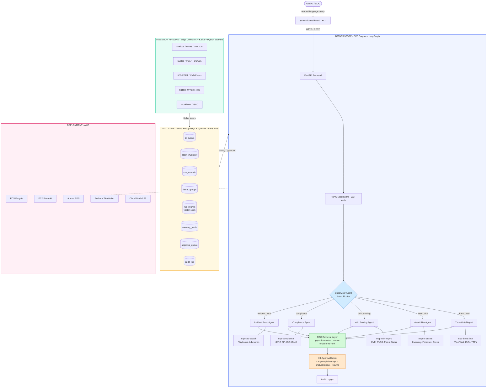

# Cybersec Agentic AI System

An OT/ICS cybersecurity agentic AI platform built with LangGraph, FastAPI, AWS Bedrock, and PostgreSQL + pgvector. Enables SOC analysts to query threat intelligence, asset risk, vulnerabilities, compliance posture, and incident response playbooks via natural language.

## Tech Stack

| Layer | Technology |
|---|---|
| Frontend | Streamlit (EC2) |
| API | FastAPI + JWT RBAC |
| Agentic Core | LangGraph (ECS Fargate) |
| LLM | AWS Bedrock (TitanHaiku) |
| Embeddings | AWS Bedrock Titan Embed |
| Vector DB | Aurora PostgreSQL + pgvector |
| Message Queue | Apache Kafka |
| Infra | AWS ECS Fargate, EC2, Aurora RDS, CloudWatch, S3 |

---

## Architecture



---

## Project Structure

```
cybersec-agentic-ai/
├── app/
│   ├── main.py                    # FastAPI entrypoint
│   ├── config.py                  # Pydantic settings
│   ├── middleware/rbac.py         # JWT Auth + RBAC
│   ├── agent/                     # LangGraph graph, state, supervisor, HIL, audit
│   ├── agents/                    # 5 specialist agents
│   ├── mcp/                       # 5 MCP tool servers
│   ├── rag/                       # Retriever, reranker, embeddings
│   ├── db/                        # PostgreSQL connection + ORM models
│   └── models/                    # Request/response schemas
├── ingestion/                     # Edge collectors + Kafka workers
├── frontend/streamlit_app.py      # SOC Dashboard
├── infra/                         # ECS task def, RDS init SQL, CloudWatch Terraform
├── tests/                         # pytest test suites
├── .env.example                   # Environment variable template
├── requirements.txt
└── .gitignore
```

---

## Quick Start

```bash
# 1. Clone the repo
git clone https://github.com/your-org/cybersec-agentic-ai.git
cd cybersec-agentic-ai

# 2. Set up environment
cp .env.example .env
# Fill in AWS credentials, DB connection, API keys

# 3. Install dependencies
pip install -r requirements.txt

# 4. Initialize the database
psql -h $POSTGRES_HOST -U $POSTGRES_USER -d $POSTGRES_DB -f infra/rds/init.sql

# 5. Run ingestion pipeline (one-time seed)
python -m ingestion.mitre_attack_ics
python -m ingestion.ics_cert_nvd

# 6. Start the API
uvicorn app.main:app --host 0.0.0.0 --port 8000

# 7. Start the frontend
streamlit run frontend/streamlit_app.py
```

---

## Agents

| Agent | Intent | MCP Tool | Data Source |
|---|---|---|---|
| Threat Intel Agent | `threat_intel` | mcp-threat-intel | VirusTotal, IOC DB, TTPs |
| Asset Risk Agent | `asset_risk` | mcp-ot-assets | asset_inventory, firmware DB |
| Vuln Scoring Agent | `vuln_scoring` | mcp-vuln-mgmt | cve_records, NVD |
| Compliance Agent | `compliance` | mcp-compliance | NERC CIF, IEC 62443 |
| Incident Resp Agent | `incident_resp` | mcp-cap-search | Playbooks, CISA advisories |

---

## Key Features

- **Natural Language Queries** — SOC analysts query in plain English
- **Supervisor Intent Routing** — LangGraph routes to the correct specialist agent
- **RAG with Re-ranking** — pgvector cosine search + cross-encoder for precision
- **Human-in-the-Loop** — LangGraph interrupt for analyst approval before sensitive actions
- **RBAC** — JWT-based role enforcement (analyst / admin / readonly)
- **Full Audit Trail** — every action logged to audit_log table
- **Real-time Ingestion** — Kafka-based pipeline from OT edge devices and threat feeds

---

## License

MIT
